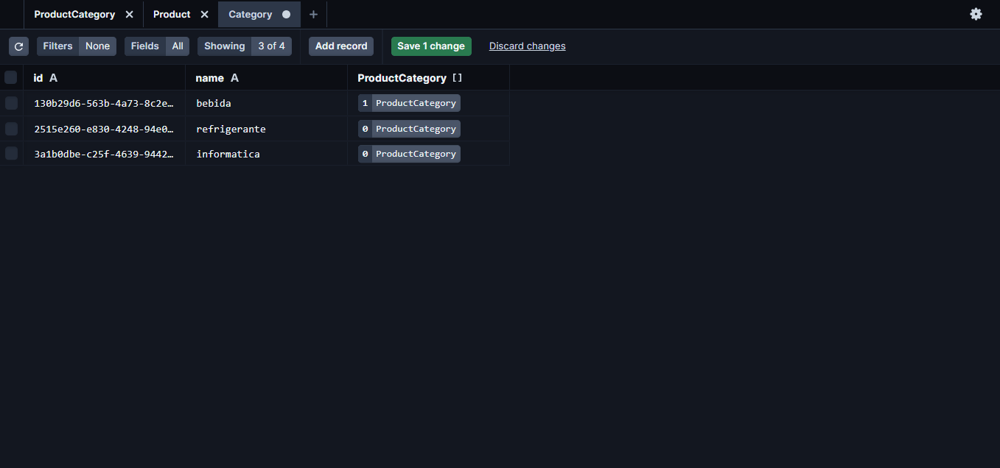

---
Docker Start
docker run postgres
docker run --name postgresql -e POSTGRES_PASSWORD=admin -d postgres

docker run --name postgresql -e POSTGRES_PASSWORD=admin -p 5432:5432 -d postgres

---
# Demos

### Demo Prisma Studio

### Demo Prisma API


---
<h1 align="center">
  <center>Prisma: o ORM Node.js que você precisa em 2022
</center>
</h1>

<p align="center">Nessa live vimos o poder do <a href="https://www.prisma.io">PrismaIO</a> e os motivos para usarmos ele em nossas aplicações</p>

## 👨🏼‍💻 Instrutor

- [Dani Leão](https://www.instagram.com/dani_leao/)

## ✋🏻 Pré-requisitos

- [Node.js](https://nodejs.org/en/)
- [Yarn](classic.yarnpkg.com/en/docs/install)

## 🔥 Instalação e execução

1. Faça um clone desse repositório;
2. Entre na pasta `cd prisma_decode`;
3. Rode `yarn` ;
4. Rode `yarn prisma generate` para instalar os models do prisma no projeto
5. Rode `yarn dev` ou `npm run dev` para rodar a aplicação;
6. Acesse a URL `http://localhost:4003`;

## Como mostrar log da aplicação?

```ts
const prismaClient = new PrismaClient({
  log: ["error", "info", "query", "warn"],
});
```

## Como incluir informações em um select com relacionamento

```ts
const product = await prismaClient.product.findFirst({
  where: {
    id,
  },
  include: {
    ProductCategory: {
      // Seleciona o model
      include: {
        category: true, // Dentro do model seleciono o relacionamento que quero trazer completo.
      },
    },
  },
});
```

Esse projeto está sob a licença MIT. Veja o arquivo [LICENSE](LICENSE.md) para mais detalhes.

---

Feito com 💖 by Rocketseat 👋 [Entre na nossa comunidade!](https://discordapp.com/invite/gCRAFhc)
